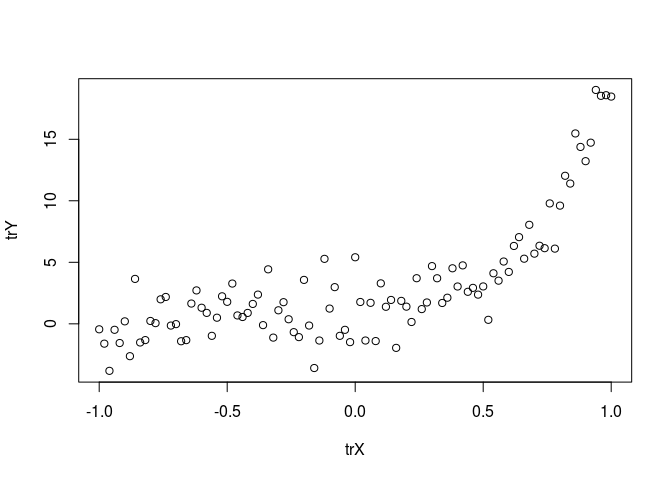
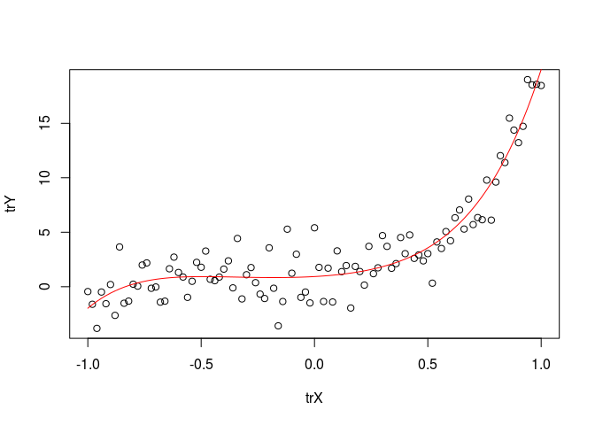

Ch 03: Concept 02
================

Polynomial regression
=====================

Import the relevant libraries and initialize the hyper-parameters

``` r
library(tensorflow)

learning_rate <- 0.01
training_epochs <- 40
```

Set up some fake raw input data

``` r
trX <- seq.int(-1, 1, length.out = 101)
```

Set up raw output data based on a degree 6 polynomial

``` r
num_coeffs <- 6
trY_coeffs <- c(1, 2, 3, 4, 5, 6)
trY <- 0
for(i in 1:num_coeffs){
    trY <- trY + trY_coeffs[i] * trX^(i-1)
}
```

Add some noise

``` r
trY <- trY +rnorm(length(trX), mean = 0, sd=1.3) * 1.5
```

Plot the raw data

``` r
plot(trX, trY)
```



``` r
X <- tf$placeholder("float")
Y <- tf$placeholder("float")
```

Define our polynomial model

``` r
model <- function(X, w){
    terms <- list()
    for(i in 0:(num_coeffs-1)){
        term <- tf$multiply(w[i], tf$pow(X, i))
        terms[[i+1]] <- term 
    }
    return(tf$add_n(terms))
}
```

Set up the parameter vector to all zero

``` r
w <- tf$Variable(tf$zeros(num_coeffs,dtype = 'float'), name="parameters")
y_model <- model(X, w)
```

Define the cost function just as before

``` r
cost <- tf$reduce_sum(tf$square(Y-y_model))
train_op <- tf$train$GradientDescentOptimizer(learning_rate)$minimize(cost)
```

Set up the session and run the learning algorithm just as before

``` r
sess <- tf$Session()
init <- tf$global_variables_initializer()
sess$run(init)

for(epoch in 1:training_epochs){
    for(i in 1:length(trX)){
        sess$run(train_op, feed_dict=dict(X= trX[i], Y= trY[i]))
    }
}

w_val <- sess$run(w)
print(w_val)
```

    ## [1] 0.9349267 1.1665890 4.3310685 4.6033034 3.7153454 5.1843162

Close the session when done

``` r
sess$close()
```

Plot the result

``` r
plot(trX, trY)
trY2 <- 0
for(i in 1:num_coeffs){
    trY2 <- trY2 + w_val[i] * trX^(i-1)
}
lines(trX, trY2, col='red')
```


