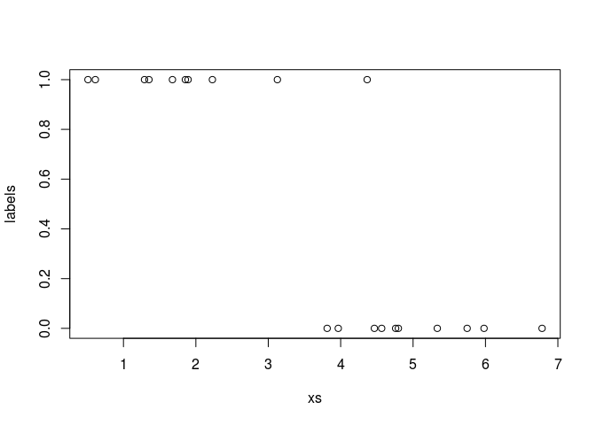
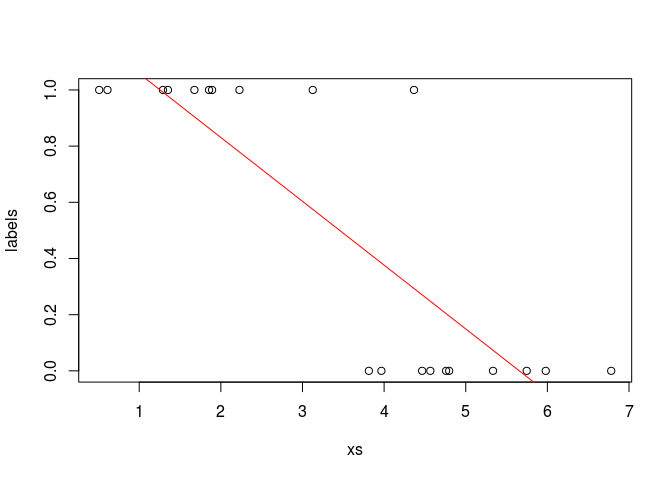

Ch 04: Concept 01
================

Linear regression for classification (just for demonstrative purposes)
======================================================================

Import the usual libraries:

``` r
library(tensorflow)
library(reticulate)
np <- import('numpy')
py <- import_builtins()
```

Let's say we have numbers that we want to classify. They'll just be 1-dimensional values. Numbers close to 2 will be given the label \[0\], and numbers close to 5 will be given the label \[1\], as designed here:

``` r
#이번에는 Python 방식으로... 
#x_label0 <- rnorm(10, mean = 5, sd = 1)
x_label0 <- np$random$normal(5, 1, 10L)
x_label1 <- np$random$normal(2, 1, 10L)
xs <- np$append(x_label0, x_label1)
labels <- c(rep(0.0, py$len(x_label0)) , rep(1.0, py$len(x_label1)))

plot(xs, labels)
```



Define the hyper-parameters, placeholders, and variables:

``` r
learning_rate <- 0.001
training_epochs <- 1000

X <- tf$placeholder("float")
Y <- tf$placeholder("float")

w <- tf$Variable(c(0., 0.), name="parameters")
```

Define the model:

``` r
model <- function(X, w){
    return(tf$add(tf$multiply(w[1], tf$pow(X, 1)),
                  tf$multiply(w[0], tf$pow(X, 0))))
}
```

Given a model, define the cost function:

``` r
y_model <- model(X, w)
cost <- tf$reduce_sum(tf$square(Y-y_model))
```

Set up the training op, and also introduce a couple ops to calculate some metrics, such as accuracy:

``` r
train_op <- tf$train$GradientDescentOptimizer(learning_rate)$minimize(cost)
correct_prediction <- tf$equal(Y, tf$to_float(tf$greater(y_model, 0.5)))
accuracy <- tf$reduce_mean(tf$to_float(correct_prediction))
```

Prepare the session:

``` r
sess <- tf$Session()
init <- tf$global_variables_initializer()
sess$run(init)
```

Run the training op multiple times on the input data:

``` r
for(epoch in 1:training_epochs){
    sess$run(train_op, feed_dict=dict(X= xs, Y= labels))
    current_cost <- sess$run(cost, feed_dict=dict(X= xs, Y= labels))
    if(epoch %% 100 == 0){
        print(paste(epoch, current_cost))
    }
}
```

    ## [1] "100 2.75124049186707"
    ## [1] "200 1.67878758907318"
    ## [1] "300 1.48481643199921"
    ## [1] "400 1.44973349571228"
    ## [1] "500 1.44338822364807"
    ## [1] "600 1.44224059581757"
    ## [1] "700 1.44203293323517"
    ## [1] "800 1.44199538230896"
    ## [1] "900 1.44198858737946"
    ## [1] "1000 1.44198739528656"

Show some final metrics/results:

``` r
w_val <- sess$run(w)
print(paste('learned parameters', w_val))
```

    ## [1] "learned parameters 1.28541815280914"  
    ## [2] "learned parameters -0.227276176214218"

``` r
accu <- sess$run(accuracy,  feed_dict=dict(X= xs, Y= labels))

print(paste('accuracy', accu))
```

    ## [1] "accuracy 0.949999988079071"

``` r
sess$close()
```

learned parameters c(1.2854182 -0.2272762) accuracy 0.95

Plot the learned function

``` r
plot(x=xs, y=labels)
all_xs <- seq.int(0, 10, length.out = 100)
lines(x=all_xs, y=all_xs*w_val[[2]] + w_val[[1]], col="red")
```


