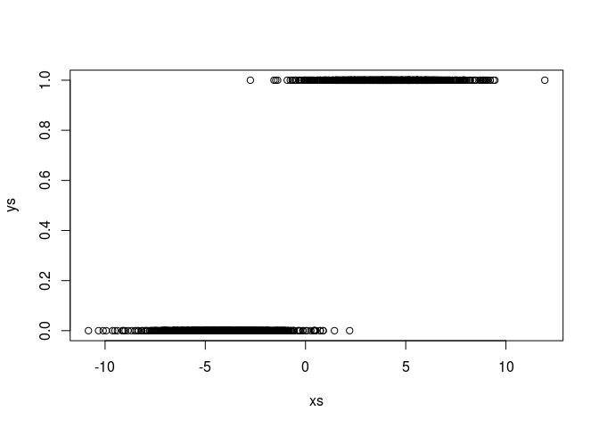
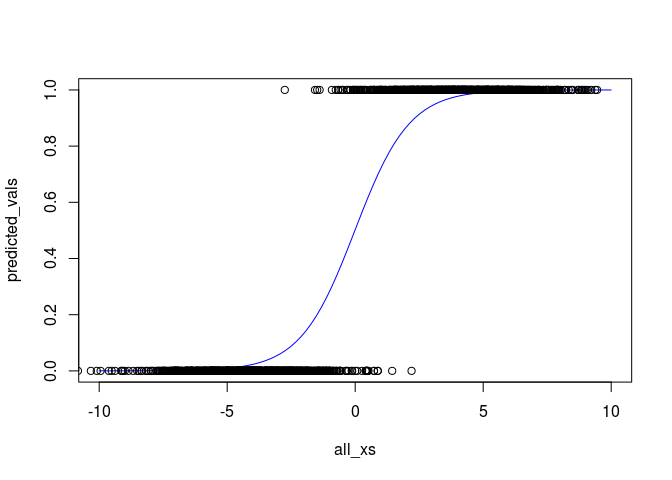

Ch 04: Concept 02
================

Logistic regression
===================

Import the usual libraries, and set up the usual hyper-parameters:

``` r
library(tensorflow)
learning_rate <- 0.01
training_epochs <- 1000
```

Set up some data to work with:

``` r
x1 <- rnorm(1000, -4, 2)
x2 <- rnorm(1000, 4, 2)
xs <- c(x1, x2)
ys <- c(rep(0, length(x1)), rep(1, length(x2)))
plot(xs, ys)
```



Define the placeholders, variables, model, cost function, and training op:

``` r
X <- tf$placeholder(tf$float32, shape=c(NULL), name="x")
Y <- tf$placeholder(tf$float32, shape=c(NULL), name="y")
w <- tf$Variable(c(0., 0.), name="parameter", trainable=TRUE)
y_model <- tf$sigmoid(w[1] * X + w[0])
cost <- tf$reduce_mean(-Y * tf$log(y_model) - (1 - Y) * tf$log(1 - y_model))

train_op <- tf$train$GradientDescentOptimizer(learning_rate)$minimize(cost)
```

Train the logistic model on the data:

``` r
with(tf$Session() %as% sess, {
    sess$run(tf$global_variables_initializer())
    prev_err <- 0
    for(epoch in 1:training_epochs){
        err_ = sess$run(list(cost, train_op), dict(X= xs, Y= ys))
        if(epoch %% 100 == 0)
            print(paste(epoch, err_[[1]]))
        if(abs(prev_err - err_[[1]]) < 0.0001)
            break
        prev_err <- err_[[1]]
    }
    w_val <- sess$run(w, dict(X= xs, Y= ys))
})
```

    ## [1] "100 0.132454305887222"
    ## [1] "200 0.0954353213310242"
    ## [1] "300 0.0810389965772629"

Now let's see how well our logistic function matched the training data points:

``` r
all_xs <- seq.int(-10, 10, length.out = 100)
with(tf$Session() %as% sess,{
    predicted_vals <- sess$run(tf$sigmoid(all_xs * w_val[2] + w_val[1]))
})

plot(all_xs, predicted_vals,type = 'l', col='blue')
points(xs, ys)
```


