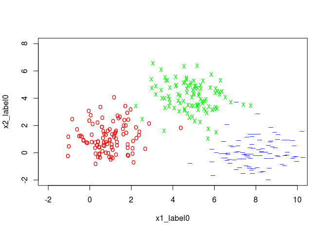

Ch 04: Concept 04
================

Softmax classification
======================

Import the usual libraries:

``` r
library(tensorflow)
```

Generated some initial 2D data:

``` r
learning_rate <- 0.01
training_epochs <- 1000
num_labels <- 3
batch_size <- 100


x1_label0 <- rnorm(100, 1, 1)
x2_label0 <- rnorm(100, 1, 1)
x1_label1 <- rnorm(100, 5, 1)
x2_label1 <- rnorm(100, 4, 1)
x1_label2 <- rnorm(100, 8, 1)
x2_label2 <- rnorm(100, 0, 1)

plot(x1_label0, x2_label0, col='red', pch='o', xlim=c(-2, 10), ylim=c(-2, 8))
points(x1_label1, x2_label1, col='green', pch='x')
points(x1_label2, x2_label2, col='blue', pch='_')
```



Define the labels and shuffle the data:

``` r
xs_label0 <- cbind(x1_label0, x2_label0)
xs_label1 <- cbind(x1_label1, x2_label1)
xs_label2 <- cbind(x1_label2, x2_label2)

xs <- rbind(xs_label0, xs_label1, xs_label2)
labels <- rbind(matrix(rep(c(1,0,0), length(x1_label0)),ncol = 3, byrow = T),
                matrix(rep(c(0,1,0), length(x1_label1)),ncol = 3, byrow = T),
                matrix(rep(c(0,0,1), length(x1_label2)),ncol = 3, byrow = T))


arr <- sample(1:nrow(xs), nrow(xs))
xs <- xs[arr,]
labels = labels[arr,]
```

We'll get back to this later, but the following are test inputs that we'll use to evaluate the model:

``` r
test_x1_label0 <- rnorm(10, 1, 1)
test_x2_label0 <- rnorm(10, 1, 1)
test_x1_label1 <- rnorm(10, 5, 1)
test_x2_label1 <- rnorm(10, 4, 1)
test_x1_label2 <- rnorm(10, 8, 1)
test_x2_label2 <- rnorm(10, 0, 1)


test_xs_label0 <- cbind(test_x1_label0, test_x2_label0)
test_xs_label1 <- cbind(test_x1_label1, test_x2_label1)
test_xs_label2 <- cbind(test_x1_label2, test_x2_label2)

test_xs <- rbind(test_xs_label0, test_xs_label1, test_xs_label2)
test_labels <- rbind(matrix(rep(c(1,0,0), length(test_x1_label0)),ncol = 3, byrow = T),
                     matrix(rep(c(0,1,0), length(test_x1_label1)),ncol = 3, byrow = T),
                     matrix(rep(c(0,0,1), length(test_x1_label2)),ncol = 3, byrow = T))
```

Again, define the placeholders, variables, model, and cost function:

``` r
train_size <- dim(xs)[1]
num_features <- dim(xs)[2]

X <- tf$placeholder("float", shape=list(NULL, num_features))
Y <- tf$placeholder("float", shape=list(NULL, num_labels))

W <- tf$Variable(tf$zeros(list(num_features, num_labels)))
b <- tf$Variable(tf$zeros(c(num_labels)))
y_model <- tf$nn$softmax(tf$add(tf$matmul(X, W), b))

cost <- -tf$reduce_sum(Y * tf$log(y_model))
train_op <- tf$train$GradientDescentOptimizer(learning_rate)$minimize(cost)

correct_prediction <- tf$equal(tf$argmax(y_model, 1L), tf$argmax(Y, 1L))
accuracy <- tf$reduce_mean(tf$cast(correct_prediction, "float"))
```

Train the softmax classification model:

``` r
with(tf$Session() %as% sess,{
    tf$global_variables_initializer()$run()

    for(step in 1:(training_epochs * train_size %/% batch_size)){
        offset <- (step * batch_size) %% train_size
        batch_xs <- xs[offset:(offset + batch_size), ]
        batch_labels <- labels[offset:(offset + batch_size),]
        err_ <- sess$run(list(cost, train_op), feed_dict=dict(X= batch_xs, Y= batch_labels))
        if(step %% 100 == 0)
            print(paste(step, err_[[1]]))
    }

    W_val <- sess$run(W)
    print(paste('w', W_val))
    b_val <- sess$run(b)
    print(paste('b', b_val))
    print(paste("accuracy", accuracy$eval(feed_dict=dict(X= test_xs, Y= test_labels))))
})
```

    ## [1] "100 9.05059432983398"
    ## [1] "200 11.3340482711792"
    ## [1] "300 3.7450635433197"
    ## [1] "400 7.479332447052"
    ## [1] "500 10.1588582992554"
    ## [1] "600 3.09398651123047"
    ## [1] "700 6.93067264556885"
    ## [1] "800 9.61645317077637"
    ## [1] "900 2.86373662948608"
    ## [1] "1000 6.55365705490112"
    ## [1] "1100 9.24239730834961"
    ## [1] "1200 2.74272060394287"
    ## [1] "1300 6.2622241973877"
    ## [1] "1400 8.96513366699219"
    ## [1] "1500 2.66538190841675"
    ## [1] "1600 6.02657604217529"
    ## [1] "1700 8.7543888092041"
    ## [1] "1800 2.61053371429443"
    ## [1] "1900 5.83138561248779"
    ## [1] "2000 8.5918550491333"
    ## [1] "2100 2.56925344467163"
    ## [1] "2200 5.66710090637207"
    ## [1] "2300 8.46512317657471"
    ## [1] "2400 2.53699612617493"
    ## [1] "2500 5.52712202072144"
    ## [1] "2600 8.36542797088623"
    ## [1] "2700 2.51110243797302"
    ## [1] "2800 5.40663576126099"
    ## [1] "2900 8.28642749786377"
    ## [1] "3000 2.48987913131714"
    ## [1] "w -2.09542775154114"  "w -0.362287968397141" "w 0.177201360464096" 
    ## [4] "w 1.28402698040009"   "w 1.91824615001678"   "w -0.921736836433411"
    ## [1] "b 9.50079154968262"  "b -1.34150564670563" "b -8.15928649902344"
    ## [1] "accuracy 1"
