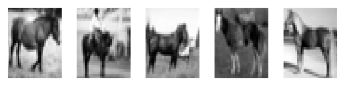
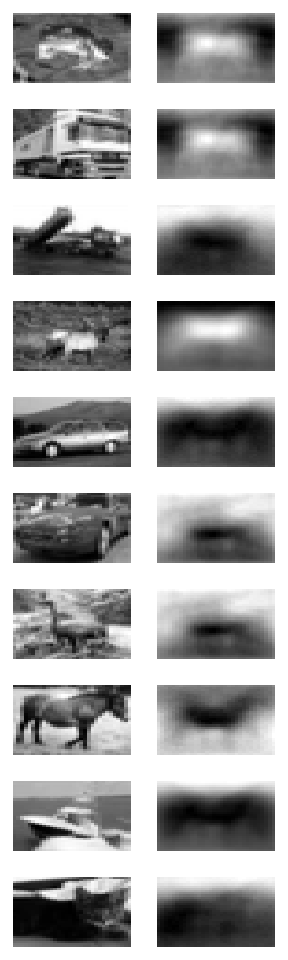
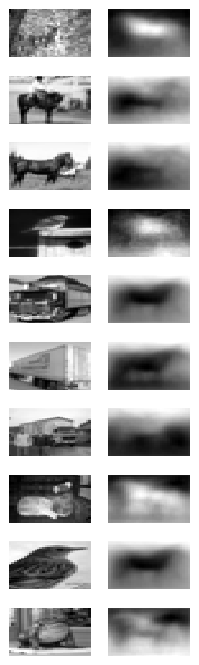

Ch 07: Concept 02
================

Autoencoder with images
=======================

Import the autoencoder class we wrote earlier:

``` r
library(knitr)
library(reticulate)
filenm <- purl("Concept01_autoencoder.Rmd")

source(filenm)
```

``` r
pickle <- import('pickle')
py <- import_builtins()


unpickle <- function(file){
    fo <- py$open(file, 'rb')
    dict <- pickle$load(fo, encoding='latin1')
    fo$close()
    return(dict)
}


grayscale <- function(a){
  imgs <- aperm(array(t(data), dim = c(32, 32,3,nrow(data))), perm=c(4,3,2,1))
  grayscale_imgs <- apply(imgs, c(1,3,4), mean)
  grayscale_imgs_w<- apply(grayscale_imgs, c(1), function(x){x})
  return(t(apply(grayscale_imgs_w, 2,rev)))
}
```

Download the CIFAR-10 dataset in Python from <https://www.cs.toronto.edu/~kriz/cifar.html>. Then we can load the data using the following code:

``` r
names <- unpickle(paste0("cifar-10-batches-py","/","batches.meta"))$label_names

filenames <- list.files("cifar-10-batches-py",pattern = "data_batch",full.names = T)
batch_data <- lapply(filenames, unpickle)

data_list <- lapply(batch_data, function(x){
  x$data
  })
data <- do.call(rbind, data_list)

labels_list <- lapply(batch_data, function(x){
  x$labels
  })
labels <- do.call(c, labels_list)

x <- grayscale(data)
y <- labels
```

Train the autoencoder on images of horses:

``` r
horse_indices <- which(labels == 7)
horse_x = x[horse_indices,]
print(dim(horse_x)) 
```

    ## [1] 5000 1024

``` r
par(mfrow=c(1,5), mar = rep(1, 4))
num_examples<- 5

for(i in 1:num_examples){
  horse_img <- matrix(horse_x[i,], byrow=T, nrow=32)
  image(horse_img, 
      axes = FALSE, col = grey(seq(0, 1, length = 256)))
  
}
```



``` r
input_dim <- dim(horse_x)[2]
hidden_dim <- 100
ae <- Autoencoder$new(input_dim, hidden_dim)
ae$train(horse_x)
```

    ## [1] "epoch 50: loss = 46.522511"
    ## [1] "epoch 100: loss = 47.680244"
    ## [1] "epoch 150: loss = 48.945663"
    ## [1] "epoch 200: loss = 58.313343"
    ## [1] "epoch 250: loss = 50.077698"
    ## [1] "epoch 300: loss = 54.402054"
    ## [1] "epoch 350: loss = 51.897457"
    ## [1] "epoch 400: loss = 47.022156"
    ## [1] "epoch 450: loss = 51.340378"
    ## [1] "epoch 500: loss = 57.876442"

    ## [1] "./model.ckpt"

``` r
test_data <- unpickle('./cifar-10-batches-py/test_batch')
test_x <- grayscale(test_data[['data']])
test_labels <- test_data[['labels']]
encodings <- ae$classify(test_x, test_labels)
```

    ## [1] 50000  1024
    ## [1] "data 50000" "data 1024" 
    ## [1] "reconstructed 50000" "reconstructed 1024" 
    ## [1] "loss length 50000"
    ## [1] "horse 51.3009221892531"
    ## [1] "not horse 50.9304309871452"

``` r
par(mfrow=c(10,2), mar = rep(1, 4))

for(i in 1:20){
  org_img <- test_x[i,]
  image(matrix(org_img, byrow=T , nrow=32), 
      axes = FALSE, col = grey(seq(0, 1, length = 256)))
  
  encode_img <- ae$decode(matrix(encodings[i,], nrow=1, byrow=T))
  image(encode_img, 
      axes = FALSE, col = grey(seq(0, 1, length = 256)))

}
```


