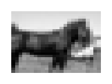
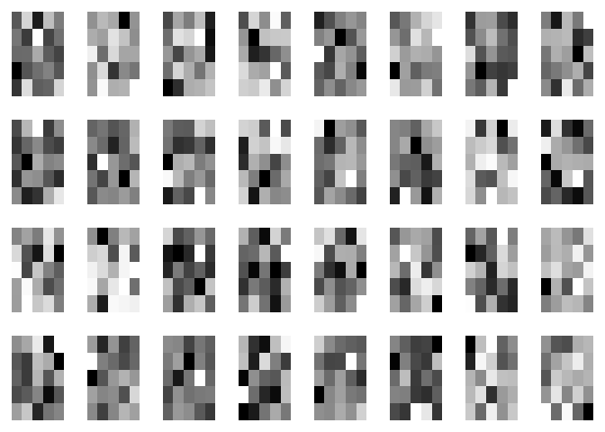
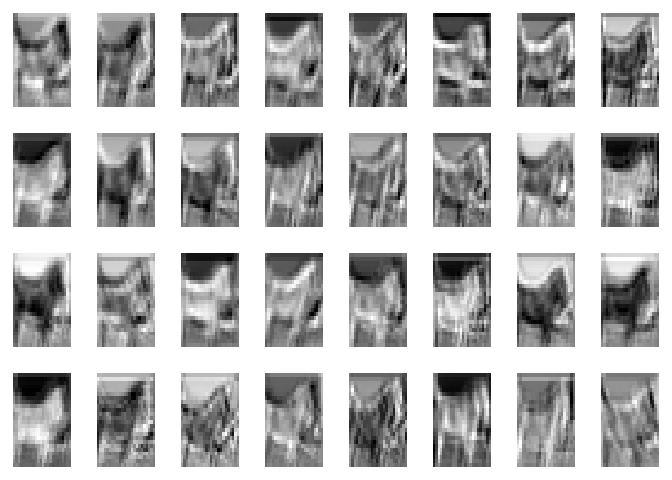
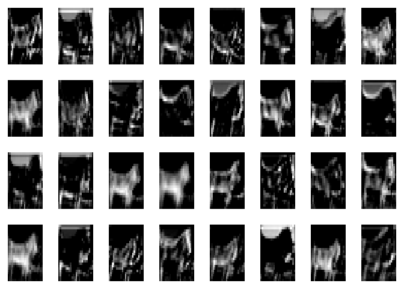
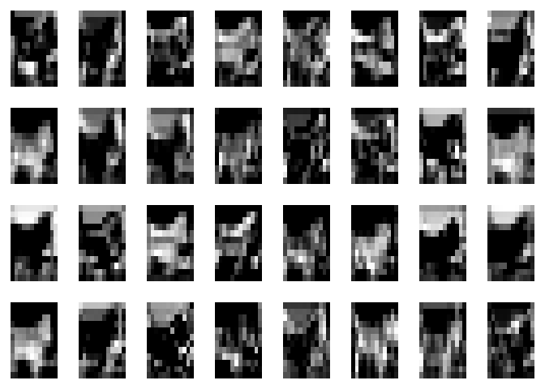

Ch 09: Concept 02
================

Convolutions and maxpool
========================

Load the CIFAR-10 images, and define helper functions to visualize the convolutions and weights:

``` r
source("Concept01_cifar.R")

names_data_labels <- read_data('./cifar-10-batches-py')
```

    ##  [1] "airplane"   "automobile" "bird"       "cat"        "deer"      
    ##  [6] "dog"        "frog"       "horse"      "ship"       "truck"     
    ## 50000 3072 ,  50000

``` r
library(tensorflow)

show_conv_results <- function(data, filename=NULL){
  if(!is.null(filename)){
    png(filename)
  }
  par(mfrow=c(4,8), mar = rep(1, 4))
  for(i in 1:dim(data)[4]){
    img <- data[,,,i]
    image(img, axes = F, col = grey(seq(0, 1, length = 256)))
  }
  if(!is.null(filename)){
    dev.off()
  }
}

show_weights <- function(W, filename=NULL){
  if(!is.null(filename)){
    png(filename)
  }
  par(mfrow=c(4,8), mar = rep(1, 4))
  for(i in 1:dim(W)[4]){
    img <- W[,,,i]
    image(img, axes = F, col = grey(seq(0, 1, length = 256)))
  }
  if(!is.null(filename)){
    dev.off()
  }
}
```

Let's start with a an example image:

``` r
data <- names_data_labels$data
img_idx <- 13
print(names_data_labels$names[names_data_labels$labels[img_idx] + 1])
```

    ## [1] "horse"

``` r
raw_data <- data[img_idx,]
raw_img <- t(array(raw_data, dim = c(24,24)))

par(mar = rep(1, 4))
image(raw_img, axes = F, col = grey(seq(0, 1, length = 256)))
```



Define the TensorFlow ops:

``` r
x <- tf$reshape(raw_data, shape=list(-1L, 24L,24L,1L))
# 
W <- tf$Variable(tf$random_normal(list(5L, 5L, 1L, 32L)))
b <- tf$Variable(tf$random_normal(list(32L)))

conv <- tf$nn$conv2d(x, W, strides = list(1L,1L,1L,1L), padding='SAME')
conv_with_b <- tf$nn$bias_add(conv, b)
conv_out <- tf$nn$relu(conv_with_b)


k <- 2L
maxpool <- tf$nn$max_pool(conv_out, ksize=list(1L, k, k, 1L), strides=list(1L, k, k, 1L), padding='SAME')
```

Visualize the effects of running the convolution and maxpool ops:

``` r
with(tf$Session() %as% sess, {
    sess$run(tf$global_variables_initializer())

    W_val <- sess$run(W)
    print('weights:')
    show_weights(W_val)
    
    conv_val <- sess$run(conv)
    print('convolution results:')
    print(dim(conv_val))
    show_conv_results(conv_val)
    
    conv_out_val <- sess$run(conv_out)
    print('convolution with bias and relu:')
    print(dim(conv_out_val))
    show_conv_results(conv_out_val)

    
    maxpool_val <- sess$run(maxpool)
    print('maxpool after all the convolutions:')
    print(dim(maxpool_val))
    show_conv_results(maxpool_val)
    
    
})
```

    ## [1] "weights:"



    ## [1] "convolution results:"
    ## [1]  1 24 24 32



    ## [1] "convolution with bias and relu:"
    ## [1]  1 24 24 32



    ## [1] "maxpool after all the convolutions:"
    ## [1]  1 12 12 32


