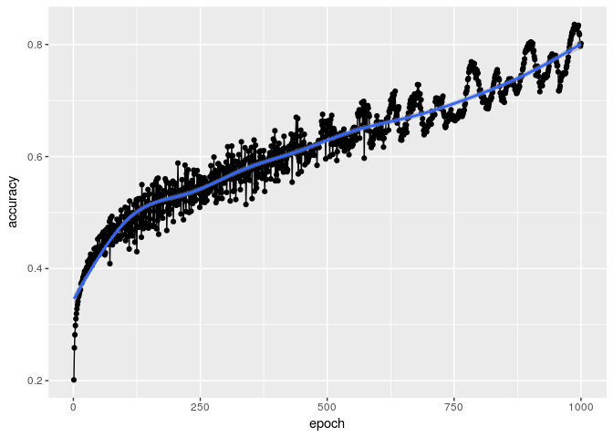
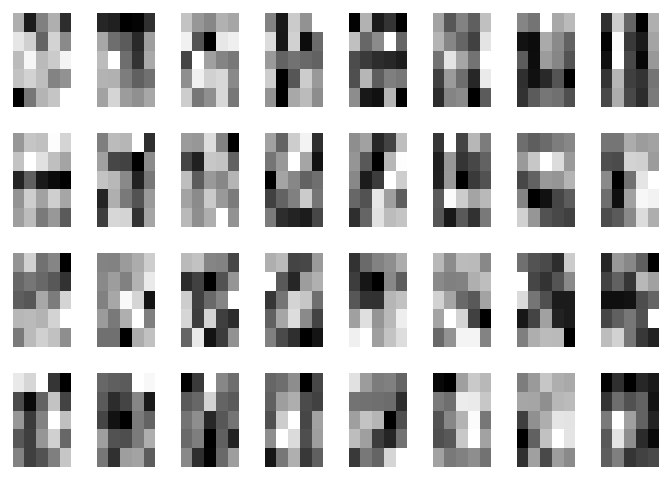
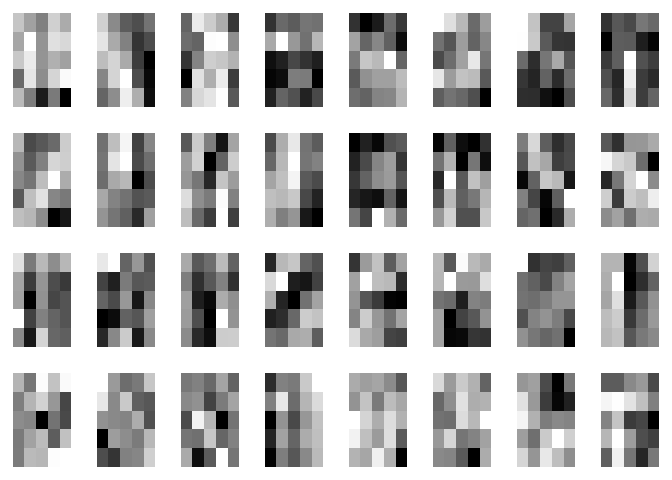
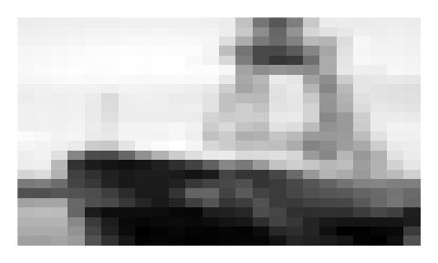
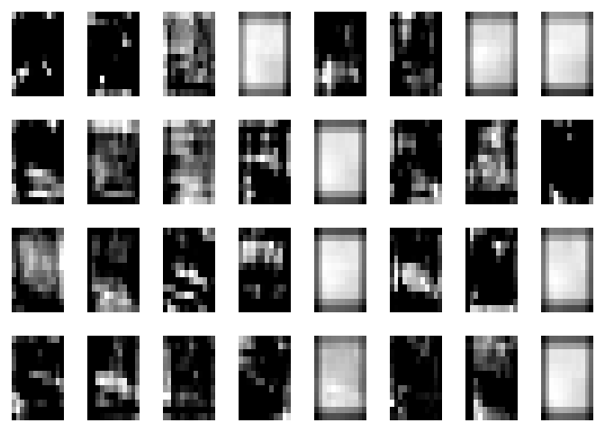
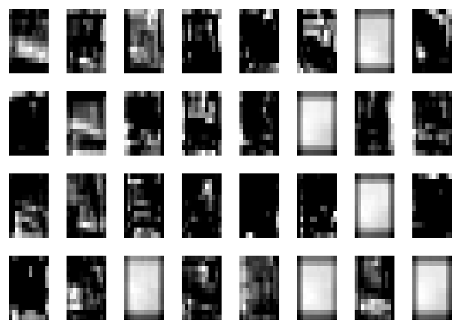

Concept04\_cifar
================

학습 정확도 추이

``` r
library(ggplot2)
library(data.table)
load("accuracy_list.RData")

accuracy_dt <- rbindlist(accuracy_list)

ggplot(accuracy_dt, aes(epoch, accu)) + geom_point() + 
  geom_line(group=1) + ylab("accuracy") + geom_smooth()
```

    ## `geom_smooth()` using method = 'gam'



학습된 가중치 시각화

``` r
source("Concept01_cifar.R")
```

``` r
names_data_labels <- read_data('./cifar-10-batches-py')
```

    ##  [1] "airplane"   "automobile" "bird"       "cat"        "deer"      
    ##  [6] "dog"        "frog"       "horse"      "ship"       "truck"     
    ## 50000 3072 ,  50000

커널 매트릭스 출력

``` r
library(tensorflow)
source("Concept03_cnn.R")
source("Concept02_convolution.R")

sess <- tf$InteractiveSession()

saver$restore(sess, "saver/model_1000.chkp-1")

w1_val <- sess$run(W1)

print('weights1:')
```

    ## [1] "weights1:"

``` r
show_weights(w1_val)
```



``` r
img_idx <- 222
names_data_labels$names[names_data_labels$labels[img_idx] + 1]
```

    ## [1] "ship"

``` r
raw_data <- names_data_labels$data[img_idx,]
raw_img <- t(array(raw_data, dim = c(24,24)))

par(mar = rep(1, 4))
image(raw_img, axes = F, col = grey(seq(0, 1, length = 256)))
```



콘볼루션 적용 후 출력 이미지

``` r
conv_res <- sess$run(conv_out2, feed_dict=dict(x=matrix(names_data_labels$data[img_idx,], ncol=576)))

print(dim(conv_res))
```

    ## [1]  1 12 12 64

``` r
show_conv_results(conv_res)
```



``` r
sess$close()
```
