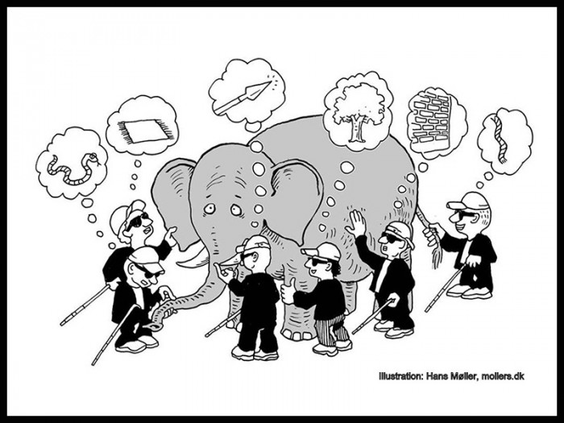
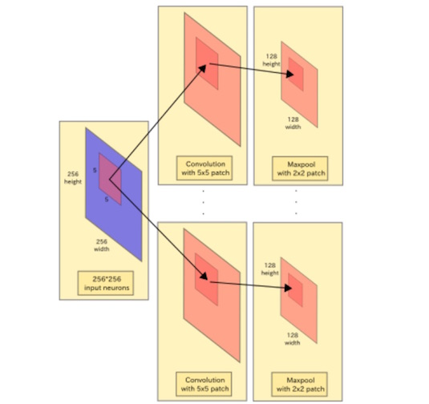
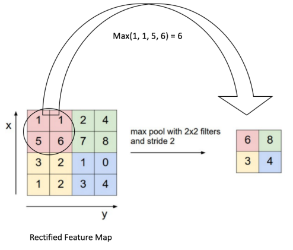

```{r setup, include=FALSE}
knitr::opts_chunk$set(echo = TRUE, fig.width = 4, fig.height = 2)
```


## fully connected network의 단점 

* 속성이 늘어남에 따라 발생하는 오버피팅 
    + 256 x 256 이미지를 10개의 히든레이어 뉴런에 적합한다고 할때 (`256 * 256 * 10` = 655,360 파라메터 생성)
    + 학습 데이터의 양을 늘린다? 
    + 파라메터 수를 줄인다?


* 데이터 형상이 무시됨
    + 공간적인 가까움과 같은 패턴을 표현하기 어렵다. 
  


## CNN (convolution neural network) 




* convolution : 이미지 픽셀의 가중합을 의미
    + convolving : 이미지에 convolution을 적용하는 과정


## Convolving



* 256 x 256  흑백 이미지에 5 x 5의 커널(필터) n개를 적용한다. 
    + 필터별 (5(w) x 5(h) + 5(bias)) 개의 파라메터 생성 
    + 30 x n 개의 파라메터를 학습함 
* 이미지가 아무리 커지더라도 파라메터를 제한할 수 있다. 


##  Convolution 적용 방식 

예) 


* 5 x 5 이미지에 3 x 3 필터 하나를 적용할때(stride 1, padding 0)
    + 3 x 3 이미지가 출력됨 

* 컨볼루션 이미지 크기 계산식  
    +  W,H : 입력 이미지 크기, FW,FH : 필터 크기, S: Stride, P: Padding 
    + 출력 이미지 높이 : $OH=\frac{H + 2P - FH}{S} + 1$
    + 출력 이미지 너비 : $OW=\frac{W + 2P - FW}{S} + 1$
        - $OW = \frac{5 +  2 \cdot 0 - 3}{1} + 1=3$
        - $OH = \frac{5 +  2 \cdot 0 - 3}{1} + 1=3$


## Pooling 




* 특징 
    + 학습할 매개 변수가 없다. 
    + 채널수가 변하지 않는다. 
    + 강건하다. 
* Max pooling, Mean pooling 등등 


## TensorFlow(R) 예제 

1. [데이터 준비](Concept01_cifar.Rmd) : 32 x 32 x 3 -> 24 x 24 x 1(채널)
1. [convolution](Concept02_convolution.Rmd) : 필터 효과 확인
1. [학습](Concept03_cnn.Rmd) : 학습 
1. [모형](Concept04_cifar.Rmd) : 학습 결과 


## Reference 

* https://ujjwalkarn.me/2016/08/11/intuitive-explanation-convnets/
* https://github.com/haven-jeon/TensorFlow-Book-R/tree/master/ch09_cnn 


