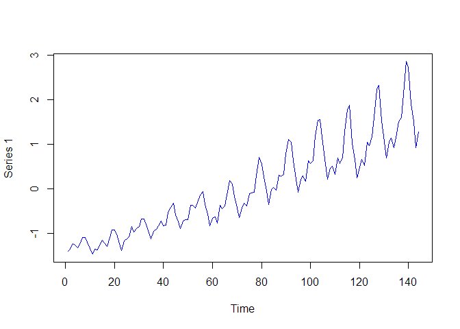

Ch 10: Concept 01
================

Processing timeseries data
==========================

Load a CSV file, where each row is a feature vector:

``` r
load_series <- function(filename){
  data <- read.csv(filename, header=F)[,2]
  normalized_data <- scale(data)
  return(normalized_data)
}
```

Split the timeseries dataset into two components. The first section will be for training, and the next section will be for testing.

``` r
split_data <- function(data, percent_train=0.8){
  num_rows <- length(data)
  train_data <- c()
  test_data <- c()
  for(idx in 1:num_rows){
    if(idx <= num_rows * percent_train){
      train_data <- append(train_data, data[idx])
    }else{
      test_data <- append(test_data, data[idx])
    }
  }
  return(list(train_data, test_data))
}
```

Download some CSV timeseries data. Like the one here <https://datamarket.com/data/set/22u3/international-airline-passengers-monthly-totals-in-thousands-jan-49-dec-60#!ds=22u3&display=line>.

``` r
# https://datamarket.com/data/set/22u3/international-airline-passengers-monthly-totals-in-thousands-jan-49-dec-60#!ds=22u3&display=line
timeseries <- load_series('international-airline-passengers.csv')
print(dim(timeseries))
```

    ## [1] 144   1

``` r
plot(ts(timeseries),col='blue')
```


